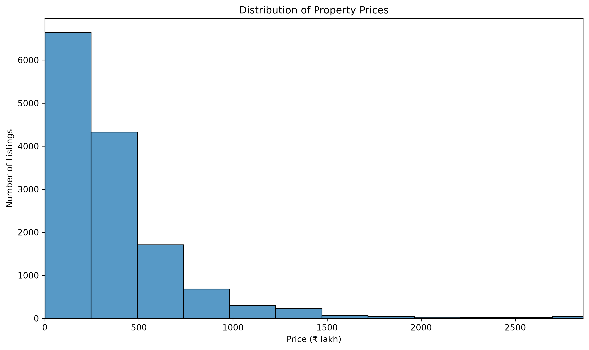
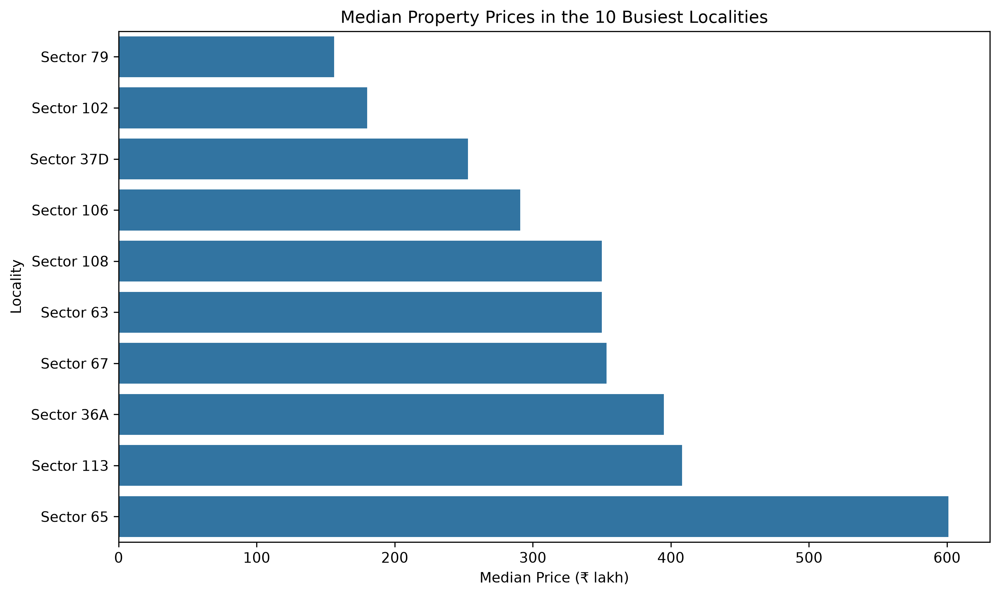
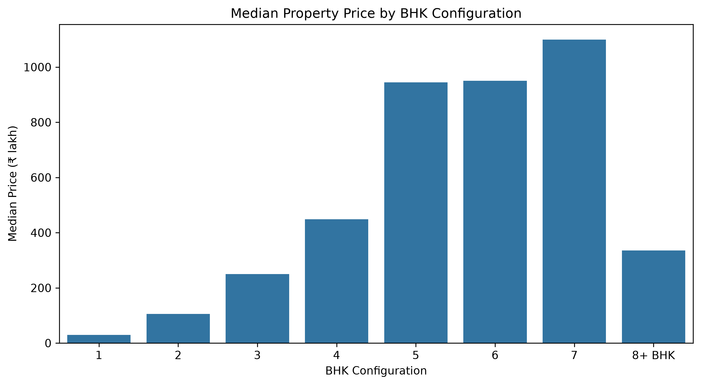
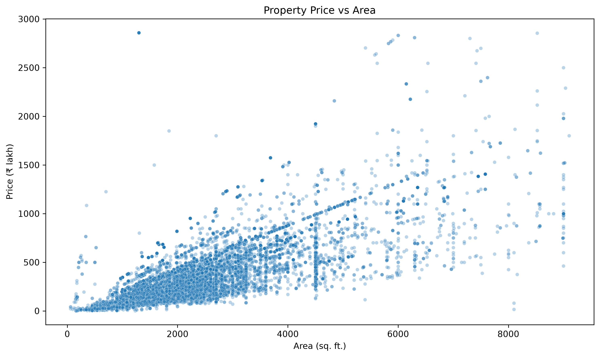

# PropertyLens – Residential Real Estate Market & Pricing Analytics

PropertyLens is a Python data analytics project focused on residential real estate listings in Gurugram, India. I started with a basic real estate analysis and expanded it into a more detailed study of property prices, localities, property configurations and other listing characteristics.

The project covers the full analysis workflow, from data cleaning and quality checks to exploratory analysis, statistical testing, regression analysis, market segmentation and locality-based relative pricing.

Rather than focusing only on the most expensive property or locality, I wanted to understand how prices vary across different groups, what patterns appear in the available listings, and where the data needs to be interpreted carefully.

## What this project covers

* Data inspection, cleaning and standardization
* Duplicate detection and removal
* Data quality checks and outlier investigation
* Price, area and rate-per-square-foot analysis
* Locality-level market comparisons
* BHK and property type analysis
* Company and listing-source analysis
* RERA approval comparison
* Ready-to-move vs under-construction analysis
* Price distribution and percentile analysis
* Pearson and Spearman correlation
* Statistical testing between selected groups
* Regression-based price analysis
* Price-based market segmentation
* Locality-based relative pricing
* Visual analysis of the main findings

## Project workflow

```text
Original Dataset
       ↓
Data Inspection
       ↓
Data Cleaning and Standardization
       ↓
Data Quality and Outlier Investigation
       ↓
Feature Engineering
       ↓
Exploratory Data Analysis
       ↓
Statistical and Relationship Analysis
       ↓
Price Driver Analysis
       ↓
Market Segmentation
       ↓
Locality-Based Relative Pricing
       ↓
Final Market Insights and Visualizations
```

## Dataset

The project uses the [Gurgaon Real Estate Dataset of 2024 on Kaggle](https://www.kaggle.com/datasets/nikhilmehrahr26/gurgaon-real-estate-dataset).

The dataset contains residential property listings from Gurugram, with information about prices, property areas, localities, BHK configurations, construction status, RERA approval and other listing characteristics.

Some of the main fields include:

| Field           | Description                                                 |
| --------------- | ----------------------------------------------------------- |
| `Price`         | Listed property price                                       |
| `Status`        | Listing status, such as ready-to-move or under-construction |
| `Area`          | Property area                                               |
| `Rate per sqft` | Listed rate per square foot                                 |
| `Property Type` | Property description                                        |
| `Locality`      | Property location                                           |
| `Builder Name`  | Name recorded in the listing                                |
| `RERA Approval` | Approval status recorded in the dataset                     |
| `BHK_Count`     | Recorded BHK count                                          |
| `Society`       | Society or project name                                     |
| `Company Name`  | Company name associated with the listing                    |
| `Flat Type`     | Broad property category                                     |

### Dataset size

| Stage                           | Records |
| ------------------------------- | ------: |
| Original dataset                |  19,515 |
| Exact duplicate records removed |   5,290 |
| Records retained for analysis   |  14,225 |

The original dataset contained 19,515 rows and 12 columns. After standardizing the data and removing exact duplicate rows, 14,225 records remained.

The cleaned data was checked for missing values, invalid numeric conversions and unusual values. Extreme prices, areas and rates were investigated rather than automatically removed, since some records represented large plots or luxury properties.

The results in this project describe the available listings and should not be treated as a complete picture of the entire Gurugram real estate market.

## Tools used

* **Python** — data analysis
* **Pandas** — data cleaning, transformation and analysis
* **NumPy** — numerical operations
* **Matplotlib** — plotting
* **Seaborn** — statistical visualizations
* **SciPy** — statistical tests
* **Statsmodels** — regression analysis
* **Jupyter Notebook** — analysis workflow

## Data cleaning and feature engineering

The initial work focused on preparing the dataset for analysis.

This included standardizing column names, trimming unnecessary whitespace, converting prices and rates into numeric values, identifying exact duplicates, checking for invalid values, and investigating unusual BHK counts, property areas, prices and rates.

I also created additional fields to make later comparisons easier:

* `price_lakh`
* `price_crore`
* `area_sqft`
* `bhk_group`
* `price_band`
* `area_band`

These fields were used throughout the subsequent analysis.

## Visual analysis

The following charts highlight some of the main patterns found in the cleaned dataset.

### 1. Property price distribution



Property prices are right-skewed: a relatively small number of expensive listings pull the average above the median. The chart limits the displayed range to improve readability while leaving the underlying data unchanged.

### 2. Median property prices by locality



This chart compares median property prices across the ten localities with the most listings. Using the median reduces the influence of a few unusually expensive properties.

### 3. Median property price by BHK



Median prices generally increase across several of the more common BHK configurations. Larger configurations have fewer listings, so their medians should be interpreted with that limitation in mind.

### 4. Property price vs area



This scatter plot examines the relationship between property size and price. The displayed range is limited to the 99th percentile of area and price to make the main group of listings easier to inspect.

## Locality analysis

Locality analysis compares areas of Gurugram using listing volume, median property price, median rate per square foot, average area, RERA approval share and ready-to-move share.

Sector 65 has the highest listing volume in the cleaned dataset, with 857 listings.

Among localities with at least 20 listings, Sector 42 has the highest median property price and median rate per square foot in this dataset. Its median property price is ₹50.5 crore, and its median rate is approximately ₹56,698 per square foot.

These findings describe the listings available in the dataset. They do not establish that the same rankings apply to every property in those localities.

## Property configuration analysis

This part compares property prices, areas and rates across BHK configurations, property types and area groups.

Apartments are the dominant property type, with 10,895 listings. Among specified BHK configurations, 3 BHK properties are the most common, with 6,151 listings.

The analysis also covers plots, floors, villas, houses and penthouses. Smaller groups and unusual configurations are interpreted carefully because their results may depend on a limited number of listings.

## Company and listing-source analysis

The `Builder Name` field does not contain only real estate developers. It also includes brokers, property portals and generic listing-source names.

For that reason, this analysis compares company and listing-source names rather than treating the results as a ranking of builders.

Listing volumes, prices and other available characteristics describe the records associated with those names, not the overall performance or quality of the companies.

## RERA analysis

This section compares listings marked as RERA-approved with those marked as not approved.

| Measure              |     Approved | Not approved |
| -------------------- | -----------: | -----------: |
| Listings             |        5,450 |        8,775 |
| Median price         | ₹2.705 crore |  ₹2.58 crore |
| Median rate per sqft |      ₹14,200 |      ₹11,544 |
| Median area          |   1,800 sqft |   2,200 sqft |

The median rate per square foot is higher among approved listings in this dataset. However, the groups also differ in property area, construction status and property composition.

The observed difference is therefore not treated as proof that RERA approval causes higher prices.

## Ready-to-move vs under-construction properties

This analysis compares ready-to-move and under-construction listings using price, area and rate per square foot.

| Measure              | Ready to move | Under construction |
| -------------------- | ------------: | -----------------: |
| Listings             |         7,825 |              5,269 |
| Median price         |   ₹2.60 crore |        ₹2.86 crore |
| Median area          |    2,225 sqft |         1,855 sqft |
| Median rate per sqft |       ₹11,646 |            ₹14,750 |

Under-construction listings have a higher median price and median rate per square foot despite having a smaller median area.

The groups also have different property and RERA compositions. These figures describe an observed difference between the listings rather than an isolated effect of construction status.

## Price distribution and outlier analysis

Property prices, areas and rates are unevenly distributed. A relatively small number of expensive properties and unusually large plots affect the averages.

To examine this, I compared means and medians, calculated percentiles, grouped listings into price bands and investigated unusually high prices, areas and rates.

The median property price is ₹2.62 crore, compared with a mean of approximately ₹4.00 crore. This difference reflects the influence of high-priced listings.

The ₹2–5 crore band is the largest, accounting for 39.21% of the cleaned dataset. Overall, 78.98% of listings fall between ₹1 crore and ₹10 crore.

Unusual values were investigated rather than removed solely because they were far from the average.

## Correlation and statistical analysis

Pearson and Spearman correlation were used to examine relationships between price, area, rate per square foot and BHK configuration.

Both measures were included because the data contains skewed distributions and relationships that may not be adequately described by a simple linear correlation.

Statistical tests were also used to compare selected groups:

* Ready-to-move vs under-construction listings
* RERA-approved vs not-approved listings
* Selected BHK groups

These tests help assess whether the observed group distributions differ statistically. Statistical significance alone does not establish causation, and the results need to be considered alongside the size and composition of each group.

## Price driver analysis

An ordinary least squares (OLS) regression with log-transformed property price was used to examine associations between price and selected listing characteristics.

The model includes:

* Property area
* BHK group
* Property type
* Construction status
* RERA approval status

Rate per square foot was excluded because it is mathematically related to property price and area.

The fitted model has an \(R^2\) of approximately 0.684 across 14,225 observations. This describes the proportion of variation in log-transformed price explained by the included variables in this model; it is not a measure of out-of-sample prediction accuracy.

The results are interpreted as associations within the dataset, not proof of causation.

## Market segmentation

Listings were grouped into project-specific price segments:

| Segment    | Price range     | Listings |
| ---------- | --------------- | -------: |
| Budget     | Below ₹1 crore  |    2,149 |
| Mid-Market | ₹1–2 crore      |    3,343 |
| Premium    | ₹2–5 crore      |    5,578 |
| High-End   | ₹5–10 crore     |    2,315 |
| Luxury     | Above ₹10 crore |      840 |

The Premium segment is the largest, containing 5,578 listings, or 39.21% of the cleaned dataset.

These categories were created for this project to make comparisons easier. They are analytical groupings rather than official real estate market classifications.

## Locality-based relative pricing

This analysis compares each eligible listing's rate per square foot with the median rate for listings in the same locality and property type.

A minimum of 20 listings is required for a locality and property-type benchmark. Eligible listings are grouped into three relative pricing categories:

* **Lower-Priced:** more than 10% below the comparable median
* **Market-Aligned:** within 10% of the comparable median
* **Premium-Priced:** more than 10% above the comparable median

The benchmark was available for 12,635 listings, representing 88.82% of the cleaned dataset.

| Relative pricing category | Listings | Share of benchmarked listings |
| ------------------------- | -------: | ----------------------------: |
| Lower-Priced              |    4,182 |                        33.10% |
| Market-Aligned            |    4,729 |                        37.43% |
| Premium-Priced            |    3,724 |                        29.47% |

These labels indicate relative pricing against the selected benchmark. They do not establish whether a property is objectively good value, underpriced or a suitable investment.

## Key findings

* The cleaned dataset contains 14,225 listings after 5,290 exact duplicate rows were removed.
* Median property price is ₹2.62 crore.
* Median property area is 2,015 sqft.
* Median rate is ₹12,379 per square foot.
* The ₹2–5 crore band is the largest, accounting for 39.21% of listings.
* Apartments are the most common property type.
* 3 BHK is the most common specified BHK configuration.
* Sector 65 has the highest number of listings.
* Sector 42 has the highest median price and median rate among localities with at least 20 listings.
* RERA-approved and under-construction listings have higher median rates per square foot than their respective comparison groups, but differences in listing composition limit how these results can be interpreted.
* Locality and property-type pricing benchmarks were available for 88.82% of the cleaned dataset.

## Project structure

```text
PropertyLens-Residential-Real-Estate-Analytics/
│
├── data/
│   ├── data of gurugram real Estate.csv
│   ├── propertylens_cleaned.csv
│   └── propertylens_featured.csv
│
├── notebooks/
│   ├── 01_propertylens_real_estate_market_analysis.ipynb
│   ├── 02_Data Cleaning & Standardization.ipynb
│   ├── 03_Feature Engineering.ipynb
│   ├── 04_Data Quality & Outlier Investigation.ipynb
│   ├── 05_Basic Market Overview.ipynb
│   ├── 06_Locality-Level Market Analysis.ipynb
│   ├── 07_Property Configuration Analysis.ipynb
│   ├── 08_Builder-Company Analysis.ipynb
│   ├── 09_RERA Approval Analysis.ipynb
│   ├── 10_Ready-to-Move vs Under-Construction.ipynb
│   ├── 11_Price Distribution & Outlier Analysis.ipynb
│   ├── 12_Relationship Analysis.ipynb
│   ├── 13_Statistical Analysis.ipynb
│   ├── 14_Price Driver Analysis.ipynb
│   ├── 15_Market Segmentation.ipynb
│   ├── 16_Locality-Based Value-for-Money Analysis.ipynb
│   ├── 17_Final Market Insights.ipynb
│   └── 18_PropertyLens_Visual_Analysis.ipynb
│
├── visuals/
│   ├── 01_property_price_distribution.png
│   ├── 02_locality_median_prices.png
│   ├── 03_median_price_by_bhk.png
│   ├── 04_median_price_by_status.png
│   ├── 05_property_price_vs_area.png
│   ├── 06_locality_median_rate.png
│   ├── 07_listings_by_price_band.png
│   └── 08_median_price_by_rera_status.png
│
├── README.md
├── requirements.txt
└── .gitignore
```

## How to run the project

### 1. Clone the repository

```bash
git clone https://github.com/sh29sarathe/PropertyLens-Residential-Real-Estate-Analytics.git
```

### 2. Install the dependencies

```bash
pip install -r requirements.txt
```

### 3. Open Jupyter Notebook

```bash
jupyter notebook
```

Open the `notebooks` folder to explore the analysis. The notebooks are numbered to follow the project workflow, and the visual analysis is available in notebook 18.

## Limitations

* The analysis reflects the available dataset, not every residential property in Gurugram.
* Listing prices may differ from final transaction prices.
* Removing exact duplicate rows does not guarantee that every repeated property listing has been identified.
* Some categories contain relatively few observations.
* Extreme values may influence averages and statistical results.
* Observed associations and group differences should not be interpreted as causal effects.
* Price segments and relative pricing thresholds are project-specific analytical choices.

## What I learned

This project gave me practice with a wider data analysis workflow, from inspecting and cleaning a real estate dataset to comparing groups and interpreting the results.

The main areas I worked on were data cleaning, feature engineering, exploratory analysis, correlation, statistical testing, regression analysis and market segmentation.

It also reinforced the importance of checking data quality and group composition before drawing conclusions from averages or statistical results.

## Dataset source

The original dataset was downloaded from Kaggle:

[Gurgaon Real Estate Dataset of 2024](https://www.kaggle.com/datasets/nikhilmehrahr26/gurgaon-real-estate-dataset)

The dataset is credited to its Kaggle uploader. Please refer to the dataset page for its stated licence and usage terms.
